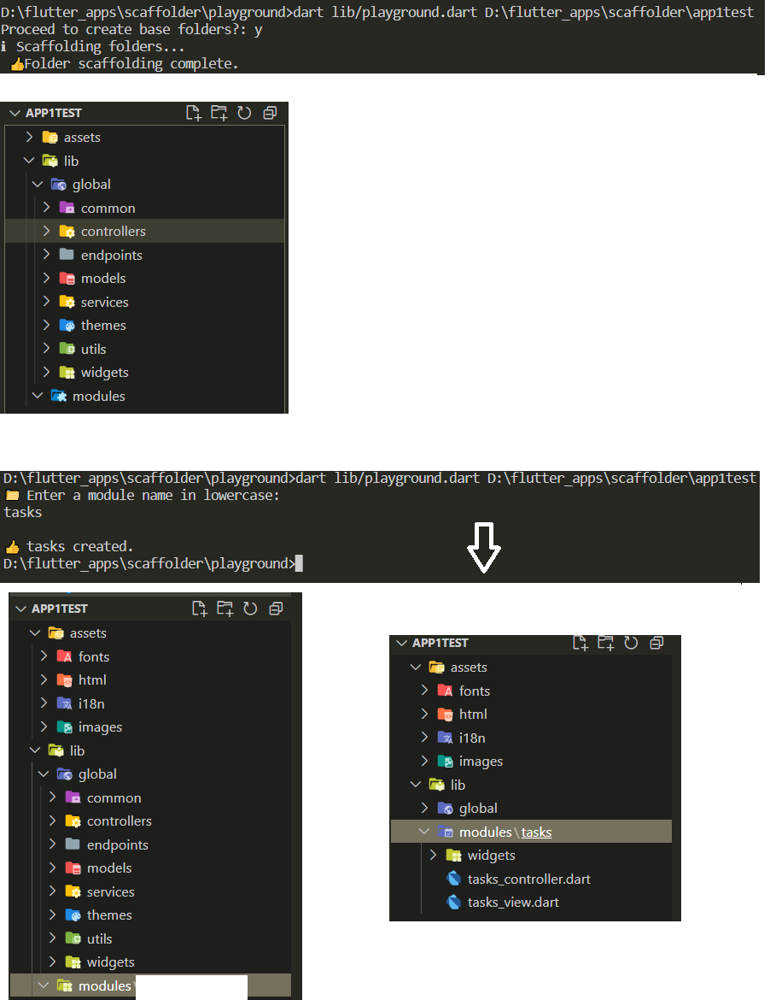

# App Folder Scaffolder thinger maggiggy!

This command line utility creates an Assets folder, /lib/global and lib/module
Flutter  app developers can benefit from this. Compile for your computer, add it to your path and boom 💥. You are off to making modules a bit faster.


## Usage from source code#: 
```dart bin/playground.dart pathToYourApp```

If you already have a "global" folder inside lib it won't ask to scaffold the assets or anyhting else except
 create new module folders.

 
## Compiling

To compile for windows, for example, use:
dart compile exe bin/playground.dart -o bin/scafolder.exe

## Caution

As far as I have tested, if you already have an assets/images folder, your files won't be deleted to recreate the folder. Test before using with existing apps.



## Have a different folder structure in mind?
Change the included lists as you see fit.